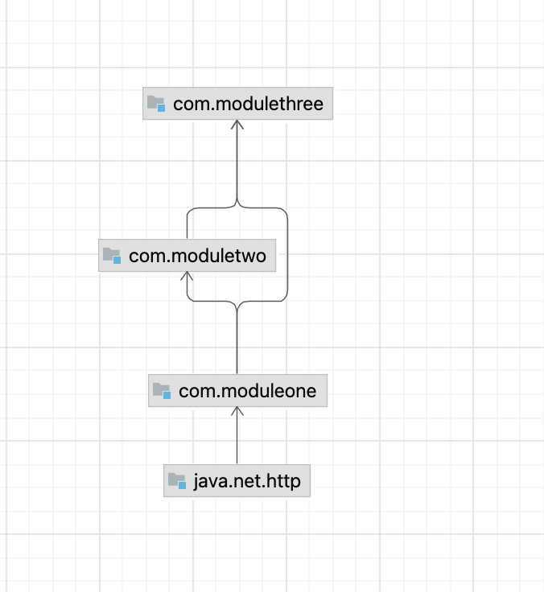

# modern-java

This repo has the code for modern java.

## Index 
[Java Installation using sdkman](#install-java-using-sdk-man)

[Manual Java Installation](#install-java-using-sdk-man)

## Install the Latest Version of JAVA using SDK man

### Install sdkMan

- Follow the instructions in the below link to install sdkman in your mac.
    - [sdkMan](https://sdkman.io/install)

### Install Java using sdk man

- Run the below command to view the different version of supported Java
```agsl
sdk list java
```
#### How to install a specific Java Version ?

- For example, to install **Java 21** run the below command.

```linux
sdk list java | grep '21'
```
- Running the below command will install Java 21.
```linux
sdk install java 21-oracle
```
 

## Java Modules

- List all the modules in the java platform.

```java
java --list-modules | wc -l
```

### modules project

- Here is the project Structure:

